# CityCare — End-to-End Production Testing Guide

This guide is designed for developers, QA engineers, and project stakeholders to perform comprehensive, end-to-end verification of the **CityCare** municipal platform across all three user roles: **Citizen**, **Staff (Field Technician)**, and **Admin (Super Administrator)**.

---

## 1. Environment & Test Credentials Directory

| User Role | Email / Username | Password | Purpose & Access Level |
| :--- | :--- | :--- | :--- |
| **Citizen (Registered)** | `testercitizen@gmail.com` | `Tester@Citizen123456` | Lodge complaints, view timeline, pay invoices, submit 5-star feedback |
| **Staff (Technician)** | `rakib.staff@citycare.com` | `Staff@1234` | Casework overview, assigned queue, field status transitions, department roster |
| **Super Admin** | `superadmin@gmail.com` | `Super@Admin123456` | Central triage, route departments, assign staff, issue invoices, audit logs |

> [!TIP]
> **1-Click Quick Login:** On the login page (`http://localhost:3000/login`), you can click the quick demo buttons to auto-populate credentials for Citizen, Staff, or Super Admin with a single click.

---

## 2. Testing Workflow Scenarios Overview

```mermaid
flowchart TD
    subgraph Scenario A: Standard Unpaid Complaint
        C1[Citizen: File Complaint via Wizard] --> A1[Admin: Triage & Route Department]
        A1 --> A2[Admin: Assign Field Technician]
        A2 --> S1[Staff: Acknowledge & Mark IN_PROGRESS]
        S1 --> S2[Staff: Perform On-Site Fix & Mark RESOLVED]
        S2 --> C2[Citizen: Verify & Submit 5-Star Feedback]
        C2 --> A3[Admin: Review & Final Close CLOSED]
    end

    subgraph Scenario B: Paid Municipal Service Complaint
        C3[Citizen: File Specialized Request] --> A4[Admin or Staff: Review & Issue Fee Invoice]
        A4 --> C4[Citizen: Open Invoices & Pay via Gateway]
        C4 --> S3[Staff: Verify Payment & Dispatch Crew]
        S3 --> S4[Staff: Resolve & Close Case]
    end
```



---

## 3. Workflow Scenario A: Standard Unpaid Complaint (Full Lifecycle)

Follow this exact step-by-step path to test an unpaid civic complaint from creation to final closure.

### Step 1: Citizen Registration & Complaint Lodging

1. **Open Browser & Sign In:**
   - Navigate to `http://localhost:3000/login`
   - Log in using `testercitizen@gmail.com` / `Tester@Citizen123456`
   - You will land on the Citizen Dashboard (`http://localhost:3000/dashboard`)
2. **Start Lodging a Complaint:**
   - Click **"Submit Request"** in the sidebar or **"Report New Complaint"** on the dashboard.
   - URL: `http://localhost:3000/dashboard/submit-request`
3. **Fill the 4-Step Wizard with Pre-Filled Data:**

#### Step 1: Category Selection
- **Department:** `Road & Infrastructure`
- **Category Card:** Click **`Road Damage`** (or `Blocked Drainage`)
- Click **"Next Step: Location"**

#### Step 2: Incident Location
- **Division / City:** `Chattogram`
- **Municipal Ward:** `Ward 01 — Agrabad`
- **Street Address:** `House 42, Road 7, Agrabad Commercial Area`
- **Landmark (Optional):** `Opposite City Bank ATM`
- Click **"Next Step: Details"**

#### Step 3: Details & Urgency
- **Complaint Classification:** `Civic Complaint`
- **Priority Level:** Click **`HIGH`**
- **Complaint Title:**  
  `Severe Asphalt Crater Causing Traffic Bottleneck`
- **Detailed Description:**  
  `Deep craters and broken asphalt on Road 7 are causing severe vehicular congestion and motorcycle accidents. Immediate patching and compaction required before rainfall.`
- Click **"Next Step: Review & Photos"**

#### Step 4: Review & Submit
- Confirm all summary fields (Category: Road Damage, Priority: HIGH, Ward: Ward 01 — Agrabad).
- Click **"Confirm & Submit Complaint"**.
- **Expected Result:** A success confirmation card appears with a generated ticket reference number (e.g. `REQ-2026-00012`).
- Click **"Track Resolution Progress"** or go to `http://localhost:3000/dashboard/requests`.

---

### Step 2: Admin Triage, Routing & Staff Assignment

1. **Log out citizen** (top right profile dropdown -> Logout) and navigate to `http://localhost:3000/login`.
2. **Sign in as Super Admin:**
   - Email: `superadmin@gmail.com`
   - Password: `Super@Admin123456`
3. **Navigate to Complaints & Triage:**
   - URL: `http://localhost:3000/admin/requests`
   - Your newly submitted complaint (`REQ-2026-XXXXX`) will be at the very top of the table.
4. **Inspect the Case File:**
   - Click the **"Triage"** action button or open `http://localhost:3000/admin/requests/[id]`.
   - Verify that all citizen statements, priority badge (`HIGH`), location, and live timeline stepper render genuine data.
5. **Route Department (If Needed):**
   - Click the **"Route Department"** button in the header.
   - Select `Road & Infrastructure` and enter note: `Verified jurisdiction. Dispatch to Zone 1 crew.`
   - Click **"Confirm Re-Routing"**.
6. **Assign Field Officer:**
   - Click the **"Assign Staff"** button in the header.
   - Select **`Engr. Rakibul Karim`** (`rakib.staff@citycare.com`).
   - Assignment Note: `Assigned as primary lead for rapid road compaction.`
   - Click **"Confirm Assignment"**.
   - **Expected Result:** Success toast appears; timeline stepper updates with an `ASSIGNED` event.

---

### Step 3: Staff Casework & Status Transitions

1. **Log out Admin** and navigate to `http://localhost:3000/login`.
2. **Sign in as Staff (Technician):**
   - Email: `rakib.staff@citycare.com`
   - Password: `Staff@1234`
3. **Verify Staff Casework Overview:**
   - URL: `http://localhost:3000/staff`
   - Verify the welcome greeting reads: `Welcome back, Rakibul Karim (Field Technician)`.
   - Check the **Key Metrics Grid** (Assigned Workload, Urgent Priority, In Progress, Overdue).
   - In **Recent Field Assignments**, verify the newly assigned complaint appears.
4. **Open Assigned Complaints Table:**
   - Navigate to `http://localhost:3000/staff/assigned`.
   - Use the search bar to filter by ticket reference (`REQ-2026-XXXXX`).
5. **Transition Status to IN_PROGRESS:**
   - In the table row, click the **"Status"** button (or click **"Triage"** to view case file and click **"Update Status"**).
   - The `StatusUpdateDialog` modal opens.
   - Click **`In Progress`**.
   - Casework Action Note:  
     `Field inspection complete. Bitumen mixture batch #4 arrived on-site. Compaction crew active.`
   - Click **"Confirm Transition"**.
   - **Expected Result:** Ticket status updates to `IN_PROGRESS` with blue badge.
6. **Transition Status to RESOLVED:**
   - Re-open the **"Status"** dialog for the same ticket.
   - Click **`Resolved`**.
   - Casework Action Note:  
     `Asphalt patch leveled and steam-rolled. Lane reopened to traffic. Inspection verified.`
   - Click **"Confirm Transition"**.
   - **Expected Result:** Ticket status transitions to `RESOLVED` with emerald badge.

---

### Step 4: Citizen Verification & Feedback Submission

1. **Log out Staff** and sign back in as Citizen (`testercitizen@gmail.com`).
2. **Open the Complaint Case File:**
   - Navigate to `http://localhost:3000/dashboard/requests/[id]`.
3. **Verify Updated Timeline:**
   - Check the **Timeline Stepper**: it now shows `SUBMITTED` -> `ASSIGNED` -> `IN_PROGRESS` -> `RESOLVED`.
   - Read the field updates logged by Engr. Rakibul Karim.
4. **Submit Citizen Satisfaction Rating:**
   - Because the ticket is `RESOLVED`, the **"Rate Resolution Quality"** button / feedback banner is unlocked.
   - Click **"Submit Feedback"**.
   - Rating: Select **5 Stars** (`★★★★★`).
   - Feedback Comment:  
     `Outstanding work by the city team! The road pothole was repaired cleanly within 24 hours.`
   - Click **"Submit Feedback"**.
   - **Expected Result:** Rating badge and citizen review note appear on the case file.

---

### Step 5: Admin Final Case Closure & Audit Verification

1. **Log in as Super Admin** (`superadmin@gmail.com`).
2. **Close the Complaint:**
   - Navigate to `http://localhost:3000/admin/requests/[id]`.
   - Click **"Update Status"**.
   - Target Status: Select **`CLOSED`**.
   - Final Archival Note:  
     `Citizen submitted 5-star positive feedback. Case closed and archived.`
   - Click **"Confirm Transition"**.
3. **Inspect the Immutable Audit Trail:**
   - Navigate to `http://localhost:3000/admin/audit-logs`.
   - Click **"Diff Preview"** on the latest audit log entry.
   - **Expected Result:** Modal displays the exact before/after JSON diff (`status: "RESOLVED" -> "CLOSED"`), user ID, timestamp, and IP address.

---

## 4. Workflow Scenario B: Paid Municipal Service Request (Billing & Checkout)

Follow this procedure to test fee issuance and online checkout.

### Step 1: Citizen Files a Specialized Service Request

1. **Sign in as Citizen** (`testercitizen@gmail.com`).
2. **Submit a Complaint via Wizard:**
   - Category: `Road & Infrastructure` or `Water & Sanitation`
   - Title: `Request for Specialized Heavy Debris Extraction`
   - Description: `Accumulation of concrete building debris blocking public drainage culvert. Specialized excavation crane required.`
   - Ward: `Ward 01 — Agrabad`
   - Street Address: `Plot 18, Commercial Belt, Agrabad`
3. Note the generated ticket number (e.g. `REQ-2026-00013`).

---

### Step 2: Admin or Staff Issues a Municipal Fee / Invoice

1. **Sign in as Admin or Staff** (`superadmin@gmail.com` or `rakib.staff@citycare.com`).
2. **Open Complaint Case File:**
   - Navigate to `http://localhost:3000/admin/requests/[id]` (or `/dashboard/requests/[id]`).
3. **Issue Municipal Invoice:**
   - In the header action bar, click **"Issue Fee"** (`Banknote` icon).
   - The `IssuePaymentModal` opens.
   - **Billing Purpose:** Select **`Municipal Service Charge`** (`SERVICE_FEE`).
   - **Fee Amount (BDT):** Enter `1500` (৳1,500 BDT).
   - **Invoice Expiry Window:** `7 Days`
   - Click **"Issue Invoice & Notify Citizen"**.
   - **Expected Result:** Success toast `Municipal Fee Issued: Invoice for ৳1500 BDT has been successfully billed`.

---

### Step 3: Citizen Pays Invoice via Gateway

1. **Sign in as Citizen** (`testercitizen@gmail.com`).
2. **Navigate to Payments:**
   - URL: `http://localhost:3000/dashboard/payments`
3. **Inspect Invoices List:**
   - You will see the new invoice for ৳1,500 with status `PENDING` and a `Pay Bill` button.
4. **Complete Payment:**
   - Click **"Pay Bill"**.
   - The payment gateway modal opens with payment method options (bKash / Nagad / Card).
   - Enter mock wallet number: `01700000011`
   - Click **"Confirm Payment"**.
   - **Expected Result:** Success notification appears; invoice status transitions from `PENDING` to `PAID`.
   - Download or view the payment receipt.

---

## 5. Pre-Filled Test Data Reference Sheets

Use these ready-to-copy values when executing your manual test runs:

### Form Dataset 1: Urgent Road Pothole (Scenario A)
```json
{
  "department": "Road & Infrastructure",
  "category": "Road Damage",
  "city": "Chattogram",
  "ward": "Ward 01 — Agrabad",
  "address": "House 42, Road 7, Agrabad Commercial Area",
  "landmark": "Opposite City Bank ATM",
  "priority": "HIGH",
  "title": "Severe Asphalt Crater Causing Traffic Bottleneck",
  "description": "Deep craters and broken asphalt on Road 7 are causing severe vehicular congestion and motorcycle accidents. Immediate patching and compaction required before rainfall."
}
```

### Form Dataset 2: Clogged Drainage (Urgent Stormwater Overflow)
```json
{
  "department": "Road & Infrastructure",
  "category": "Blocked Drainage",
  "city": "Chattogram",
  "ward": "Ward 01 — Agrabad",
  "address": "House 12, Road 4, Agrabad Commercial Area",
  "landmark": "Near Agrabad Fire Station",
  "priority": "URGENT",
  "title": "Blocked Main Drain causing Severe Waterlogging",
  "description": "The main stormwater drain on Road 4 is completely clogged with solid waste debris, leading to severe water stagnation and flooding on the street for the past 3 days. Immediate cleanup and suction vehicle deployment required."
}
```

### Form Dataset 3: Paid Municipal Service Billing
```json
{
  "purpose": "SERVICE_FEE",
  "amount": 1500,
  "currency": "BDT",
  "expiryDays": 7,
  "note": "Municipal service fee for hydraulic excavation and debris extraction machinery."
}
```

---

## 6. State Machine Validation Matrix

When testing status transitions, CityCare strictly enforces the following state machine:

| From Status | Allowed Next Statuses | Forbidden Next Statuses |
| :--- | :--- | :--- |
| `SUBMITTED` | `UNDER_REVIEW`, `ASSIGNED`, `REJECTED` | `RESOLVED`, `CLOSED` |
| `UNDER_REVIEW`| `ASSIGNED`, `PENDING`, `REJECTED` | `CLOSED` |
| `ASSIGNED` | `IN_PROGRESS`, `UNDER_REVIEW` | `CLOSED`, `REOPENED` |
| `IN_PROGRESS` | `RESOLVED`, `PENDING`, `UNDER_REVIEW` | `CLOSED` |
| `PENDING` | `IN_PROGRESS`, `UNDER_REVIEW`, `REJECTED` | `CLOSED` |
| `RESOLVED` | `CLOSED`, `REOPENED` | `ASSIGNED` |
| `CLOSED` | `REOPENED` | Any other status |
| `REJECTED` | *(Terminal State)* | Any status |

---

## 7. Pre-Deployment Acceptance Checklist

- [x] **No Mock / Demo Data:** All dashboards (Admin, Citizen, Staff) fetch 100% genuine data from the backend database.
- [x] **Citizen Overview & Listing:** Displays real total, in-progress, and resolved counts; empty states render cleanly when 0 records exist.
- [x] **Multi-Step Wizard:** Submits genuine tickets (`REQ-2026-XXXXX`) without simulated fallback mode.
- [x] **Staff Overview (`/staff`):** Dynamic greeting, real assigned workload metrics, urgent case alerts.
- [x] **Staff Queue (`/staff/assigned`):** Real-time search, status filtering, and live `StatusUpdateDialog` transitions.
- [x] **Department Roster (`/staff/department`):** Live staff membership list, category badges, and active caseload.
- [x] **Admin Central Triage (`/admin/requests`):** Re-routing departments and assigning staff members persist to backend.
- [x] **Payment Billing (`/dashboard/payments`):** Invoices render authentic amounts (BDT), status badges, and checkout flow.
- [x] **Audit Trail (`/admin/audit-logs`):** Logs every transition with before/after state diffs.
- [x] **Type Safety & Build:** Zero TypeScript compiler errors (`bun x tsc --noEmit`) and zero Biome linter warnings.
