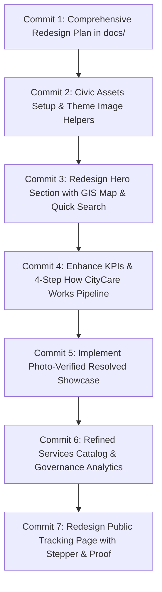

# 🏛️ CityCare — Home & Tracking Pages UI/UX Redesign Plan

> **Document Version:** 1.0.0  
> **Target Scope:** Home Page (`/`) and Public Complaint Tracking Page (`/track`)  
> **Source Inspirations:** `docs/ui_images` (Dark & Light Theme Mockups & Panoramic GIS Assets)  
> **Core Direction:** Realistic, high-contrast, production-grade civic tech platform (GovTech 2.0). Avoid cluttered or unviable mockup elements (e.g. cluttered service card fees/grids) while adopting the authentic municipal aesthetics, dual-theme harmony, interactive before/after proofs, and live GIS map visualisations.  
> **Execution Strategy:** 7 to 8 atomic, reviewable commits.

---

## 📑 Table of Contents

1. [Evaluation of Provided Design Assets (`docs/ui_images`)](#1-evaluation-of-provided-design-assets-docsui_images)
2. [Realistic Civic Tech Design Principles](#2-realistic-civic-tech-design-principles)
3. [Design System & Theme Tokens (Light & Dark)](#3-design-system--theme-tokens-light--dark)
4. [Home Page (`/`) Architectural Blueprint](#4-home-page--architectural-blueprint)
5. [Tracking Page (`/track`) Architectural Blueprint](#5-tracking-page-track-architectural-blueprint)
6. [Asset Pipeline & Theme-Aware Optimization](#6-asset-pipeline--theme-aware-optimization)
7. [Step-by-Step 7-Commit Implementation Roadmap](#7-step-by-step-7-commit-implementation-roadmap)
8. [Acceptance Criteria & Verification Checklist](#8-acceptance-criteria--verification-checklist)

---

## 1. Evaluation of Provided Design Assets (`docs/ui_images`)

The provided assets showcase an ambitious civic platform design across both Light and Dark themes:

| Asset Name | Content Description | Evaluation & Realism Verdict |
| :--- | :--- | :--- |
| **`CityCare Civic Service Dashboard.png`** | Dark theme full homepage mockup | **Strong reference:** Hero layout, live GIS activity map card, KPI sparkline stats, 4-step workflow, and before/after photo proof cards are exceptional. |
| **`CityCare Municipal Portal Dashboard.png`** | Light theme full homepage mockup | **Strong reference:** Demonstrates identical structure in a high-contrast civic light palette (crisp slate-50/white surfaces, deep navy text, sky-blue accents). |
| **`CityCare Complaint Tracking Dashboard.png`** | Side-by-side Dark & Light tracking pages | **Primary blueprint for `/track`:** Horizontal progress stepper, SLA achievement pill, two-column layout (Timeline + Ward Map & Before/After Proof) provides unmatched civic clarity. |
| **`Neon Civic Activity Map Dashboard.png`** | High-res dark GIS map with ward boundary & markers | **Asset for Dark Hero:** Use as background/visual component for the hero live map widget with glowing Ward 12 boundary. |
| **`Smart City Civic Activity Dashboard.png`** | High-res light GIS map with ward boundary & markers | **Asset for Light Hero:** Daytime cartographic aesthetic matching the light theme hero layout. |
| **`Smart City Night Dashboard.png`** | Panoramic night city skyline with pinned achievements | **Asset for Dark Governance Section:** Banner graphic for the "A city that shows its work" transparency section. |
| **`Civic Data Cityscape Dashboard.png`** | Panoramic daytime city skyline with pinned achievements | **Asset for Light Governance Section:** Daytime panoramic banner for the transparency section. |
| **`CityCare Municipal Services Portal.png`** | Service catalog card grid | **Filtered/Cautioned:** As requested by the user, this mockup will **NOT** be blindly replicated. The repetitive pricing badges ("Free Service" / "Service Fee") and cluttered repetitive card layouts feel unrealistic for a public complaint portal. Instead, we implement a sleek, focused civic service directory. |

---

## 2. Realistic Civic Tech Design Principles

To ensure the redesign looks like an authentic, dependable metropolitan government platform rather than a generic template:

1. **Pragmatic Civic Navigation & Triage:**
   - Citizens visit a municipal portal with two urgent intents: **reporting an issue** or **checking up on an existing issue**.
   - The hero section must surface an immediate tracking input and a 1-click "Report a Civic Issue" CTA with zero cognitive friction.

2. **Verifiable Photographic Proof (Before & After):**
   - The standout feature of modern GovTech is showing citizens concrete photographic evidence of completed public works (e.g., asphalt pothole repaired, street lamp re-lamped, trash dumpster cleared).
   - We will implement realistic side-by-side and interactive toggle before/after visual cards with technician field notes.

3. **SLA Accountability as a First-Class Citizen:**
   - Every ticket displays legal turnaround benchmarks (e.g., "First response: 6 hrs", "Resolution: Within 24 hrs", "Resolved in 14 hrs (SLA: 24h)").
   - Color-coded badges with high contrast for quick status recognition (Emerald for Resolved, Amber for In-Progress, Cyan for Dispatched).

4. **Streamlined Service Discovery (Fixing the Flawed Service Grid):**
   - Instead of 24 cluttered fake cards, provide 8 high-utility civic categories (Roads & Potholes, Street Lighting, Waste & Sanitation, Water Supply & Drainage, Public Parks, Environmental Hazards, Traffic & Transport, General Municipal).
   - Each category cleanly links to `/services?category=...` or `/dashboard/submit-request?category=...`.

---

## 3. Design System & Theme Tokens (Light & Dark)

The UI will automatically adapt to the user's selected theme (persisted in `localStorage` and managed by `ThemeProvider`):

### Color Palettes

```
┌───────────────────────────────┬───────────────────────────────┐
│        LIGHT THEME            │          DARK THEME           │
├───────────────────────────────┼───────────────────────────────┤
│ Background:  #f8fafc (slate-50)│ Background:  #020617 (slate-950)│
│ Surface:     #ffffff (white)   │ Surface:     #0f172a (slate-900)│
│ Card Border: #e2e8f0 (slate-200│ Card Border: #1e293b (slate-800│
│ Text Prim:   #0f172a (slate-900│ Text Prim:   #f8fafc (slate-50)│
│ Text Muted:  #64748b (slate-500│ Text Muted:  #94a3b8 (slate-400│
│ Primary Blue:#0284c7 (sky-600) │ Primary Blue:#38bdf8 (sky-400) │
│ Accent Blue: #2563eb (blue-600)│ Accent Glow: #60a5fa (blue-400)│
│ Success SLA: #16a34a (green-600│ Success SLA: #34d399 (emerald-4│
│ Warning:     #d97706 (amber-600│ Warning:     #fbbf24 (amber-400│
└───────────────────────────────┴───────────────────────────────┘
```

### Visual Enhancements
- **Glassmorphism:** `backdrop-blur-md bg-white/80 dark:bg-slate-900/80` for floating overlays.
- **Micro-Shadows:** Subtle layered shadows (`shadow-sm` on rest, `shadow-md` on hover) rather than harsh drop shadows.
- **Subtle Radial Mesh Glow:** Ambient civic blue gradients in the hero background for visual depth.

---

## 4. Home Page (`/`) Architectural Blueprint

The redesigned homepage will consist of 7 meticulously designed sections:

```
┌────────────────────────────────────────────────────────────────────────┐
│ 1. HERO SECTION: "Report it. Track it. Get it resolved."               │
│    Left: Official badge + Headings + Dual CTAs + Tracking Input        │
│    Right: Live Civic Activity GIS Map preview (Theme-Adaptive)         │
├────────────────────────────────────────────────────────────────────────┤
│ 2. KEY MUNICIPAL KPIS (4 Stat Cards with Sparklines)                   │
│    • 18,420+ Reports Filed  • 95.4% Resolution SLA Rate                │
│    • 32.6 hrs Turnaround    • 54 Active Digital Wards                  │
├────────────────────────────────────────────────────────────────────────┤
│ 3. HOW CITYCARE WORKS (4-Step Accountable Pipeline)                    │
│    01 Submit Issue → 02 Auto-Route & SLA → 03 Field Repair → 04 Verify │
├────────────────────────────────────────────────────────────────────────┤
│ 4. RECENTLY RESOLVED SHOWCASE (Real Photographic Proof)                │
│    • Pothole Patch (Ward 12) • Streetlight Restoration (Ward 08)       │
│    • Garbage Clearance (Ward 19) with Before/After viewer & notes      │
├────────────────────────────────────────────────────────────────────────┤
│ 5. FIND A CITY SERVICE (Clean Categorized Directory)                   │
│    8 Refined Civic Categories + Search Filter Bar                      │
├────────────────────────────────────────────────────────────────────────┤
│ 6. DATA-DRIVEN GOVERNANCE ("A City That Shows Its Work")               │
│    • Panoramic Cityscape Banner (Day/Night Theme Adaptive)             │
│    • Ward Resolution Bar Chart (Recharts W01–W12)                      │
│    • SLA Compliance Breakdown (95.4% on-time, 3.1% late, 1.5% overdue)│
├────────────────────────────────────────────────────────────────────────┤
│ 7. CIVIC CALL-TO-ACTION & EMERGENCY HELPLINES                         │
│    Banner with "Report a Civic Issue" & Hotline (Dial 333 / 999)       │
└────────────────────────────────────────────────────────────────────────┘
```

### Section 1: Civic Hero Banner & Live GIS Activity Showcase
- **Headline:** *"Report it. Track it. **Get it resolved.**"*
- **Subhead:** *"Submit public service complaints directly to municipal authorities, track progress in real time, and verify completed repairs with photographic proof."*
- **Inline Complaint Search:** Dedicated input with quick search button that routes directly to `/track?trackingId=...`.
- **Right Visual Card:** Responsive container displaying the theme-adaptive GIS map (`map-light.png` / `map-dark.png`) with live interactive overlays:
  - Floating badge: *"Live Civic Activity: 12 active cases, 7 in progress, 3 urgent"*.
  - Spotlit active ticket: *"CCR-2026-0891 | In Progress | Ward 12 | 18h 24m SLA remaining | Deep Pothole on Main Road"*.
  - Field staff badge: *"Technician assigned: Md. Rahim Uddin (Field Technician)"*.

### Section 2: Key Municipal Statistics
- 4 glassmorphism stat cards with micro-sparklines:
  - **18,420+** Total Reports Filed (+12% from last month)
  - **95.4%** Resolution SLA Rate (+2.3% from last month)
  - **32.6 hrs** Average Turnaround (-18% faster from last month)
  - **54** Active Municipal Wards (100% digitized coverage)

### Section 3: How CityCare Works
- Clear 4-step pipeline with civic icons, sequential step numbers (`01`, `02`, `03`, `04`), and desktop connector lines:
  1. **Report an issue:** Select category, ward location, and upload photo proof.
  2. **Auto-route to department:** Automated dispatch to the municipal desk with a legal SLA deadline.
  3. **Field inspection & repair:** Assigned field technician executes repairs and records work logs.
  4. **Verify resolution:** Citizen receives notification with after-photos and submits quality rating.

### Section 4: Recently Resolved Proof Showcase
- 3 realistic case cards with interactive Before & After image viewer:
  - Case 1: *Deep Pothole on Mirpur-10 Main Intersection* (Ward 12, Public Works, 24 hrs turnaround).
  - Case 2: *Faulty Transformer & Dark Streetlight Strip* (Ward 08, Electrical, 14 hrs turnaround).
  - Case 3: *Overflowing Garbage Dumpster on Road 7* (Ward 19, Solid Waste, 8 hrs turnaround).
- Includes technician notes, department badges, and SLA completion indicators.

### Section 5: Find a City Service (Realistic Directory)
- Clean search filter bar + 8 essential civic categories:
  - Roads & Potholes, Street Lighting, Waste & Sanitation, Water Supply & Drainage, Public Spaces & Parks, Environmental Hazards, Traffic & Transport, Other Civic Issues.
- Each card has an icon, description, and direct routing.

### Section 6: Data-Driven Governance ("A City That Shows Its Work")
- Dual-theme panoramic cityscape (`cityscape-light.png` / `cityscape-dark.png`) with milestone annotations ("Cleaner Streets: 1,240 resolved", "Better Roads: 842 completed", "Brighter Streets: 312 fixed", "Greener City: 28 spaces").
- Ward resolution performance bar chart (Ward 01 through Ward 12) powered by Recharts.
- SLA Compliance Rate widget: On Time (95.4%), Late (3.1%), Overdue (1.5%).

### Section 7: Civic CTA & Emergency Helplines
- Quick action buttons with prominent civic emergency notices (Dial 333 for civic assistance, 999 for emergency).

---

## 5. Tracking Page (`/track`) Architectural Blueprint

The public tracking page (`src/app/(public)/(marketing)/track/page.tsx` & `src/components/modules/tracking/public-tracker.tsx`) will be upgraded to match the design from `CityCare Complaint Tracking Dashboard.png`:

```
┌────────────────────────────────────────────────────────────────────────┐
│ TRACKING HEADER & QUICK-CHIPS                                          │
│ • Badge: "Track Your Complaint"                                        │
│ • Title: "Track Your Complaint Status"                                 │
│ • Search bar: Input for REQ-2026-XXXX + Track Status Button            │
│ • Quick Sample Chips: REQ-2026-0891, REQ-2026-0884, REQ-2026-0873      │
├────────────────────────────────────────────────────────────────────────┤
│ COMPLAINT SUMMARY CARD                                                 │
│ • Tracking ID + Status (RESOLVED) + Priority (HIGH) + SLA Benchmark    │
│ • Issue Title & Description                                            │
│ • 4 Meta Columns: Department, Ward Location, Reported At, Technician   │
│ • Horizontal 4-Stage Stepper with timestamps:                          │
│   Received ──→ Department Routed ──→ In Progress ──→ Resolved         │
├────────────────────────────────────────────────────────────────────────┤
│ TWO-COLUMN OPERATIONAL DETAILS                                         │
│ ┌───────────────────────────────────┬────────────────────────────────┐ │
│ │ LEFT: Activity Timeline           │ RIGHT: Location & Proof        │ │
│ │ • Real-time event log with icons  │ • Ward & GPS Map Preview       │ │
│ │ • Timestamps & official notes     │ • Before & After Photo Proof   │ │
│ └───────────────────────────────────┴────────────────────────────────┘ │
└────────────────────────────────────────────────────────────────────────┘
```

### Key Interactive Features on `/track`
1. **Interactive Sample Chips:** Clicking a chip immediately populates the search bar and loads the case without requiring manual typing.
2. **Horizontal Stepper:** Clear visual progress bar that highlights completed steps with dates and times.
3. **Activity Timeline:** Vertical audit trail detailing every action from ticket receipt, triage, technician assignment, to final verification.
4. **Photo Proof Widget:** Displays before and after photos side-by-side with zoom/inspection support.
5. **Interactive Ward Map Preview:** Stylized ward boundary visual showing where the issue was reported.

---

## 6. Asset Pipeline & Theme-Aware Optimization

To ensure fast load times and clean responsiveness:

1. Copy high-resolution visual assets from `docs/ui_images/` into `public/images/civic/`:
   - `public/images/civic/map-dark.png` (from `Neon Civic Activity Map Dashboard.png`)
   - `public/images/civic/map-light.png` (from `Smart City Civic Activity Dashboard.png`)
   - `public/images/civic/cityscape-dark.png` (from `Smart City Night Dashboard.png`)
   - `public/images/civic/cityscape-light.png` (from `Civic Data Cityscape Dashboard.png`)
   - Pre-configured before/after sample images for pothole, streetlight, and sanitation cases.
2. Build a reusable `<ThemeAdaptiveImage />` component or CSS-based dark/light selector (`hidden dark:block` and `block dark:hidden`) to avoid layout shifts or hydration flashes.

---

## 7. Step-by-Step 7-Commit Implementation Roadmap

To maintain clean git history and reviewability, the work is organized into **7 distinct commits**:



### Commit 1: `docs: create comprehensive ui ux redesign plan for home and tracking pages`
- Create `docs/HOMEPAGE_AND_TRACKING_REDESIGN_PLAN.md`.
- Define section breakdowns, mockup evaluation, realistic civic principles, and commit plan.

### Commit 2: `assets: configure light and dark civic visuals and image assets in public directory`
- Create directory `public/images/civic/`.
- Transfer and configure theme-specific visual assets (GIS maps, panoramic cityscapes, before/after sample pairs).
- Create theme-adaptive image helper component.

### Commit 3: `feat(home): redesign civic hero section with interactive map preview and quick tracking`
- Redesign `src/components/modules/home/hero-section.tsx`.
- Add theme-switching GIS map preview with live case pins, technician badge, and active ticket overlay.
- Add quick complaint tracking search input with routing to `/track`.
- Add trust guarantee pills (SLA, Photo proof, Transparency).

### Commit 4: `feat(home): enhance municipal kpis and how it works step-by-step pipeline`
- Update `src/components/modules/home/stats-counter.tsx`: Add sparklines, month-over-month deltas, and digitized ward coverage.
- Update `src/components/modules/home/how-it-works.tsx`: Implement the 4-step linear pipeline with numbered badges, responsive connectors, and crisp civic icons.

### Commit 5: `feat(home): implement photo-verified recently resolved showcase with before-after comparisons`
- Redesign `src/components/modules/home/recent-resolved-showcase.tsx`.
- Add interactive Before/After photo comparison viewer, technician work notes, ward badges, and SLA turnaround metrics.

### Commit 6: `feat(home): add refined city services catalog and data-driven governance analytics`
- Create `src/components/modules/home/city-services-section.tsx`: 8 realistic civic categories with search filter and direct navigation (avoiding cluttered pricing grids).
- Create `src/components/modules/home/governance-analytics-section.tsx`: Panoramic cityscape banner (day/night adaptive) + Recharts ward resolution bar chart + SLA compliance gauge.
- Assemble all sections in `src/app/(public)/(marketing)/page.tsx`.

### Commit 7: `feat(track): redesign public complaint tracking dashboard with stepper and photo verification`
- Redesign `src/components/modules/tracking/public-tracker.tsx` and `src/app/(public)/(marketing)/track/page.tsx`.
- Implement sample complaint quick-selection chips (`REQ-2026-0891`, `REQ-2026-0884`, `REQ-2026-0873`).
- Implement complaint summary card, 4-stage horizontal stepper, chronological activity timeline, ward GIS map card, and before/after verification gallery.
- Verify full responsive layout, theme toggle, and run production build check.

---

## 8. Acceptance Criteria & Verification Checklist

- [ ] **Dual-Theme Fidelity:** Every section looks stunning and readable in both Light and Dark modes.
- [ ] **Realistic Municipal Standards:** No generic or cluttered mockups; all copy, metrics, and workflows reflect genuine municipal administration.
- [ ] **Fast Performance & No Layout Shift:** Theme images load smoothly without hydration flashes.
- [ ] **Functional Interactivity:**
  - Hero search navigates to `/track?trackingId=...`.
  - Sample ID chips on `/track` instantly populate and display ticket details.
  - Before/after cards allow toggling or side-by-side comparison.
  - Recharts bar chart renders responsively across desktop and mobile.
- [ ] **Accessibility (WCAG AA):** High contrast text and badges, keyboard-navigable buttons, and proper semantic HTML tags.
- [ ] **Build Validation:** `npm run build` succeeds cleanly with 0 TypeScript or linting errors.
